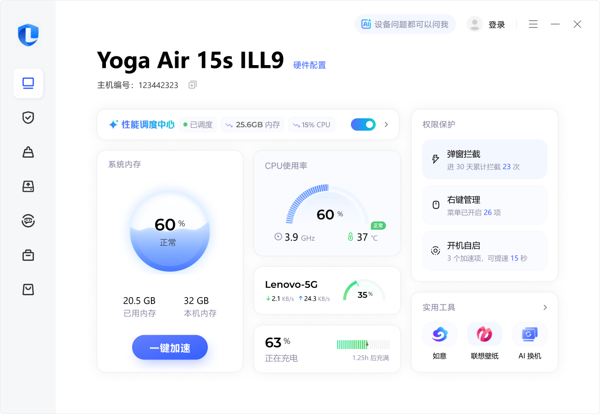
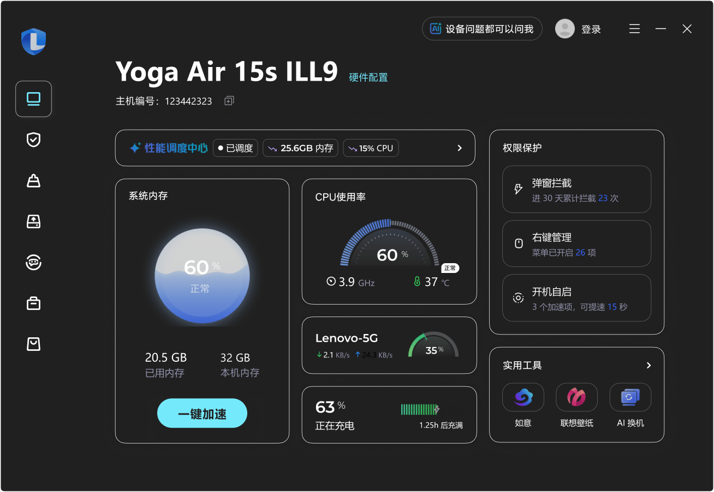
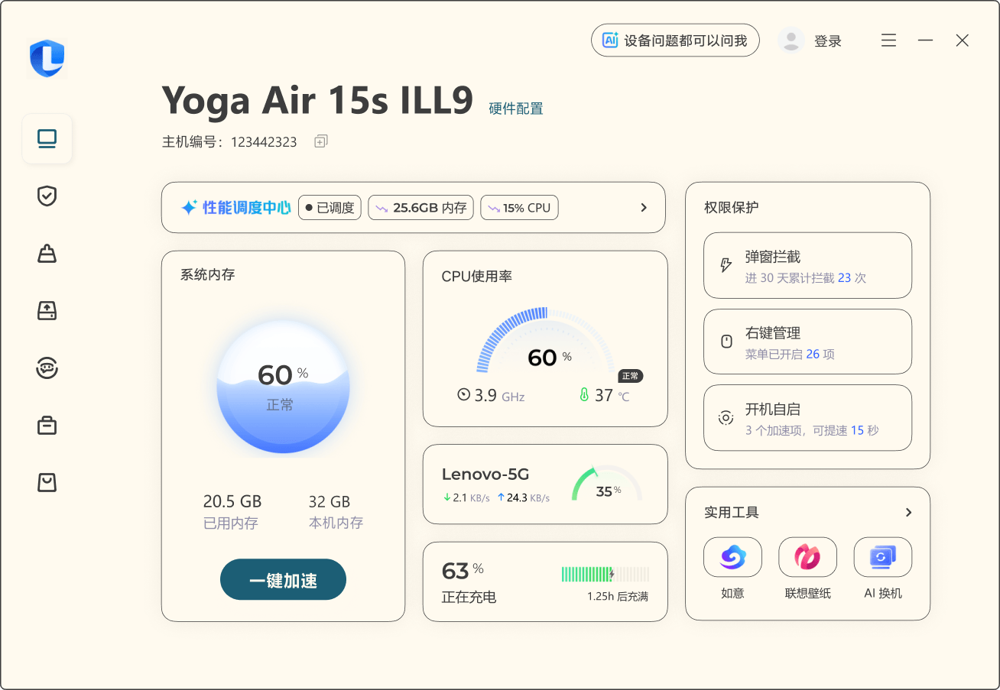
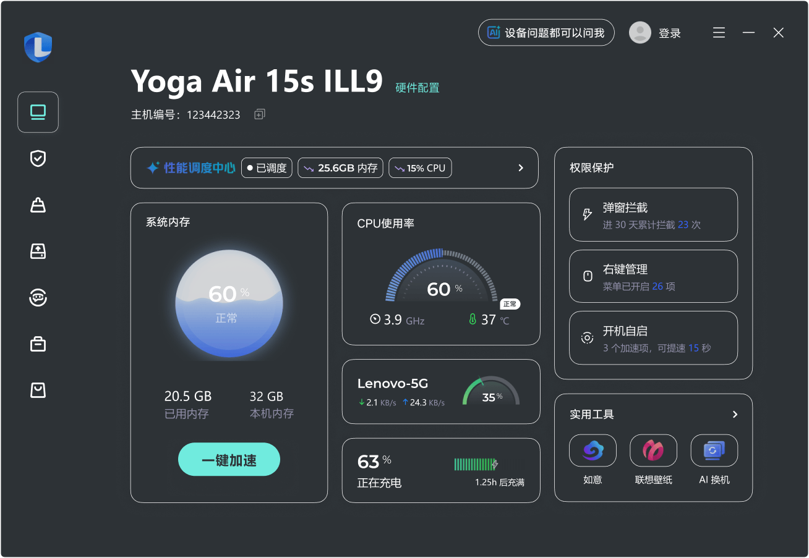
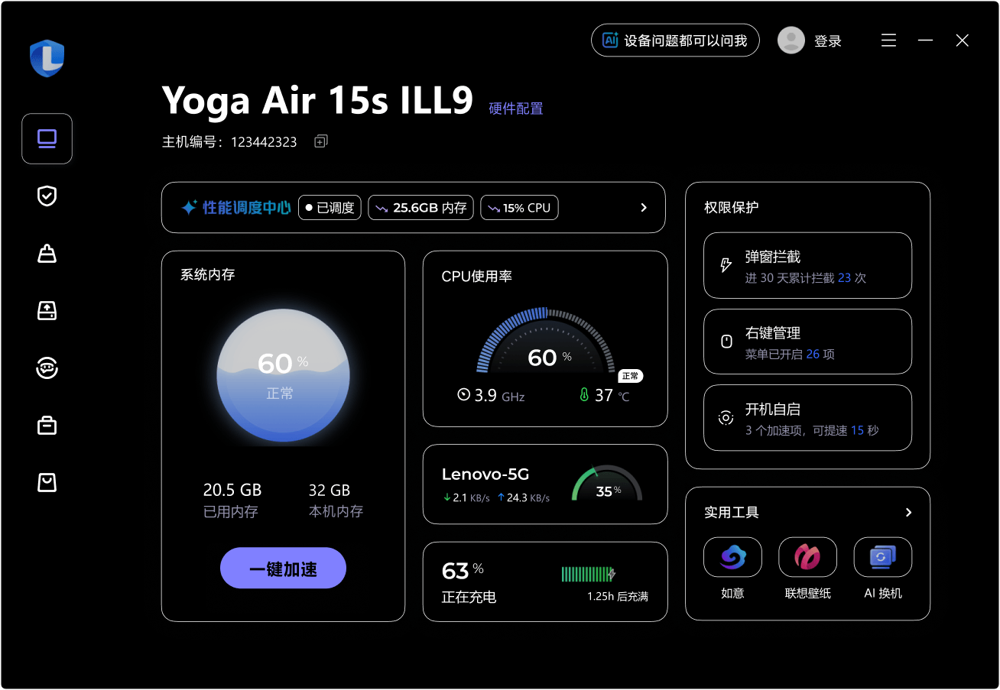
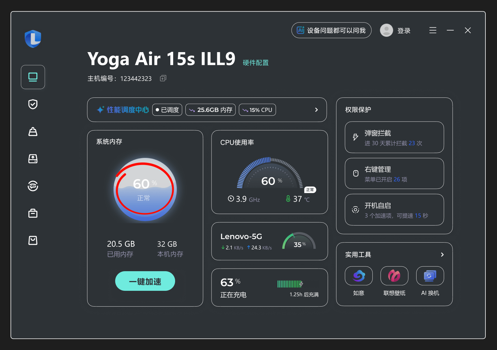

# win-a11y-theme-bridge

指导 AI 编码助手自动识别项目技术栈，并将 Windows 应用配色改造为符合 Windows 11 高对比度无障碍主题的合规实现。

---

## 样式映射效果（Figma MCP 验证）

| 默认 | Aquatic（水生） | Desert（沙漠） | Dusk（黄昏） | Night Sky（夜空） |
|------|----------------|---------------|-------------|-----------------|
|  |  |  |  |  |

---

## 解决什么问题

Windows 11 为低视力或光敏感用户提供四个内置对比度主题：

|主题|
|------|
| 水生 Aquatic |
| 黄昏 Dusk |
| 夜空 Night Sky |
| 沙漠 Desert |

当用户启用这些主题时，使用硬编码颜色值的应用会出现问题——文字不可读、可交互元素消失、悬停/禁用等状态无法区分。

在大型代码库中手动逐一修复成本极高。本项目提供一份精确的机器可读规范，让 AI 编码助手自动完成改造。

---

## 解决方案

`AGENTS.md` 包含完整规则集，指导 AI 助手：

1. 自动识别项目技术栈（CSS / WPF / WinForms / WinUI 等）
2. 将硬编码颜色值替换为对应技术栈的系统颜色引用
3. 按 UI 语义角色（背景、文字、可交互、禁用、链接、焦点）匹配正确的系统颜色槽
4. 对 SVG 按父容器语义槽映射颜色（在按钮内跟 Button Text，在正文内跟 Window Text）
5. 对暗色主题下的图片应用 80% 透明度

**AI 助手只改颜色，不修改布局、结构或元素。**

---

## 颜色映射

Windows 11 对比度主题提供 8 个系统颜色槽，应用中的所有颜色都归入其中之一。各技术栈引用方式不同，但语义槽定义一致。

| 语义槽 | 语义角色 |
|--------|---------|
| Window Background | 所有背景——页面、容器、卡片、面板、弹窗 |
| Window Text | 所有不可交互前景——正文、标题、图标 |
| Button Face | 可交互元素背景——按钮、输入框、下拉框 |
| Button Text | 可交互元素前景——按钮文字、输入框文字 |
| Highlight | 悬停 / 选中 / 激活 / 按下——背景 |
| Highlight Text | 悬停 / 选中 / 激活 / 按下——前景 |
| Hot Light | 仅用于超链接 |
| Gray Text | 仅用于禁用状态 |

### 各主题默认色值

| 语义槽 | 水生 Aquatic | 沙漠 Desert | 黄昏 Dusk | 夜空 Night Sky |
|--------|-------------|------------|----------|--------------|
| Window Background | `#202020` | `#fffaef` | `#2d3236` | `#000000` |
| Window Text | `#ffffff` | `#3d3d3d` | `#ffffff` | `#ffffff` |
| Button Face | `#202020` | `#fffaef` | `#2d3236` | `#000000` |
| Button Text | `#ffffff` | `#202020` | `#b6f6f0` | `#ffee32` |
| Highlight | `#8ee3f0` | `#903909` | `#a1bfde` | `#d6b4fd` |
| Highlight Text | `#263b50` | `#fff5e3` | `#212d3b` | `#2b2b2b` |
| Hot Light | `#75e9fc` | `#1c5e75` | `#70ebde` | `#8080ff` |
| Gray Text | `#a6a6a6` | `#676767` | `#a6a6a6` | `#a6a6a6` |

> 色值直接从 Windows 11 系统 `.theme` 文件提取，存放于 `themes/` 目录，作为测试和验证的基准数据。

---

## 使用方法

将 `AGENTS.md` 复制到项目根目录，支持 AGENTS.md 规范的 AI 编码工具（Codex、Claude Code、Cursor 等）会自动读取。

```
your-project/
├── AGENTS.md   ← 复制到这里
├── src/
└── ...
```

然后向 AI 助手发出指令：

```
按照 AGENTS.md 的规则，对项目进行 Windows 11 对比度主题无障碍合规改造。
```

AI 助手将自动识别技术栈，定位所有硬编码颜色值，按语义槽映射到对应的系统颜色引用。

---

## 文件结构

```
win-a11y-theme-bridge/
├── AGENTS.md                       # 说明书
└── themes/                         # Windows 11 系统原始主题文件
    ├── hcblack-aquatic.theme       # 水生 Aquatic
    ├── hcwhite-desert.theme        # 沙漠 Desert
    ├── hc1-dusk.theme              # 黄昏 Dusk
    └── hc2-night-sky.theme         # 夜空 Night Sky
```

---

## 测试

**启用对比度主题：**  
设置 → 辅助功能 → 对比度主题

**快速切换快捷键：**  
`左 Alt + 左 Shift + PrtScn`

---

## 需要人工复查的场景

以下情况 AI 助手无法自动判断正确性，需人工介入确认：

### 图片上叠加文字

当文字以独立 DOM 元素叠加在图片之上时，文字颜色会随对比度主题自动切换（如暗色主题变为白色），但图片像素不受 `forced-colors` 影响、保持原样。若图片恰好在文字所在区域呈现浅色（例如仪表盘、进度环的高光区域），则浅色文字叠在浅色图片上，对比度不足，导致内容不可读。

**处理方式：** 需人工逐一检查，确认文字与所在图片区域的对比度是否可读。



---

## 参考资料

- [MDN: forced-colors](https://developer.mozilla.org/en-US/docs/Web/CSS/@media/forced-colors)
- [MDN: CSS 系统颜色](https://developer.mozilla.org/en-US/docs/Web/CSS/system-color)
- [Microsoft Learn: 对比度主题](https://learn.microsoft.com/zh-cn/windows/apps/design/accessibility/high-contrast-themes)
- [AGENTS.md 格式规范](https://github.com/agentsmd/agents.md)
